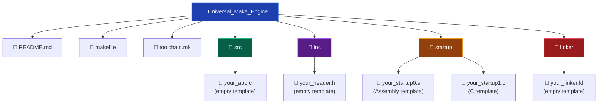
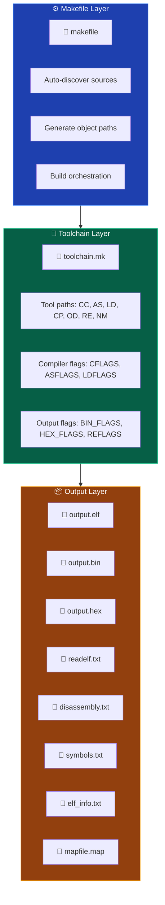
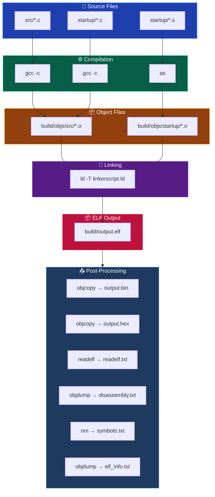

# Generic Embedded Build System using GNU Make

A scalable, architecture-independent embedded systems build system built entirely using GNU Make. This project demonstrates how to create a fully customizable cross-compilation environment without relying on IDEs such as Keil, STM32CubeIDE, or MPLAB.

Instead of hardcoding the compiler or architecture, the build system is designed to support multiple architectures and toolchains dynamically through configurable toolchain abstraction. Simply change the `TOOLCHAIN` variable or edit `toolchain.mk` to switch targets.

---

## 👨‍💻 Author

## Eng. Adel Shata

Embedded Systems & Software Engineering Enthusiast

---

## ✨ Key Idea

The build system itself is completely independent of the target architecture.

The compiler, assembler, linker, and architecture-specific flags are isolated inside `toolchain.mk`. This allows the same Makefile to work with:

- ARM GCC Toolchain
- AVR GCC Toolchain
- RISC-V Toolchains
- Native GCC
- Any custom cross compiler

Most project paths and configurations are intentionally written using `?=`, which allows users to override variables externally without modifying the original Makefile:

```make
PROJECT_NAME    ?= output
SRC_DIR         ?= src/
INCLUDES        ?= inc/
STARTUP_DIR     ?= startup/
LINKER_DIR      ?= linker/
TOOLCHAIN       ?= arm-none-eabi-
```

This design makes the build system reusable, portable, scalable, and architecture-independent. Users can fully customize the output ELF name, source directories, include directories, startup files, linker scripts, toolchains, compiler flags, and target architecture — all from the command line or external configuration files.

---

## 🚀 Features

- Generic and reusable GNU Make build system
- Architecture-independent design
- Easily customizable project structure
- Dynamic toolchain selection
- User-configurable source/include/startup/linker directories
- Automatic source file discovery (recursive up to 5 levels deep)
- Automatic object file generation with directory structure preservation
- Separate build directory generation
- Scalable modular directory support
- Support for both C and Assembly source files
- Easy integration with any cross compiler
- Configurable compiler, assembler, and linker flags
- GNU Make debugging utilities
- Clean build support
- Multiple output formats: `.elf`, `.bin`, `.hex`
- Diagnostic reports: readelf, disassembly, symbols, ELF info
- Fully IDE-independent workflow

---

## 📁 Project Structure



---

## Architecture

The build system separates concerns into three layers:



---

## Build Flow



---

## ⚙️ Toolchain Abstraction

The build system separates build logic from compiler implementation. All tools are defined relative to the `TOOLCHAIN` prefix:

```make
CC  = $(strip $(TOOLCHAIN))gcc
AS  = $(strip $(TOOLCHAIN))as
LD  = $(strip $(TOOLCHAIN))ld
CP  = $(strip $(TOOLCHAIN))objcopy
OD  = $(strip $(TOOLCHAIN))objdump
RE  = $(strip $(TOOLCHAIN))readelf
NM  = $(strip $(TOOLCHAIN))nm
```

This allows the same Makefile to work with different toolchains by changing a single variable:

```bash
# ARM (default)
make TOOLCHAIN=C:/TOOLCHAINS/ARM_TOOLCHAIN/bin/arm-none-eabi-

# AVR
make TOOLCHAIN=/usr/bin/avr-

# RISC-V
make TOOLCHAIN=/opt/riscv/bin/riscv64-unknown-elf-

# Native GCC (Linux/macOS)
make TOOLCHAIN=/usr/bin/
```

---

## 🧠 Build System Design

### Automatic Source Discovery

```make
SRC  = $(foreach src_dir, $(SRC_DIR), $(wildcard $(src_dir)*.c))
SRC += $(foreach src_dir, $(SRC_DIR), $(wildcard $(src_dir)*/*.c))
SRC += $(foreach src_dir, $(SRC_DIR), $(wildcard $(src_dir)*/*/*.c))
SRC += $(foreach src_dir, $(SRC_DIR), $(wildcard $(src_dir)*/*/*/*.c))
SRC += $(foreach src_dir, $(SRC_DIR), $(wildcard $(src_dir)*/*/*/*/*.c))
SRC += $(foreach src_dir, $(SRC_DIR), $(wildcard $(src_dir)*/*/*/*/*/*.c))
```

This recursively scans all source directories up to 5 levels deep and collects all `.c` files automatically.

### Automatic Object File Generation

```make
OBJS = $(addprefix $(strip $(OBJS_DIR)), $(patsubst %.c, %.o, $(SRC)))
```

Example transformation:

```
src/app.c  →  build/objs/src/app.o
```

### Pattern Rules

The project uses generic pattern rules to compile both C and Assembly files dynamically:

```make
# C files
$(OBJS_DIR)%.o: %.c
	@mkdir -p $(dir $@)
	$(CC) $(strip $(CFLAGS)) $< -o $@

# Assembly files
$(OBJS_DIR)%.o: %.s
	@mkdir -p $(dir $@)
	$(AS) $(strip $(ASFLAGS)) $< -o $@
```

---

## 🔍 GNU Make Debugging Techniques

One of the most important parts of the project was debugging GNU Make internals. Debugging utilities used:

```make
$(info >>> SRC is: $(SRC))
$(info >>> OBJS is: $(OBJS))
$(info >>> STARTUP_OBJS is: $(STARTUP_OBJS))
$(info >>> FIXED_NAME is: $(FIXED_NAME))
$(info >>> OBJS_DIR is: $(OBJS_DIR))
```

This helped trace:
- Generated paths
- Pattern matching behavior
- Object file generation
- Startup object generation
- Dependency expansion
- Build directory structure

---

## 🛠️ Problems Faced & Solutions

### 1. Conflicting Build Rules

**Problem:** `warning: overriding commands for target`

**Cause:** Incorrect rule definitions caused Make to overwrite build rules internally.

**Solution:** Switched to proper generic pattern rules:

```make
$(OBJS_DIR)%.o: %.c
$(OBJS_DIR)%.o: %.s
```

---

### 2. Object File Path Mismatch

**Problem:** `No rule to make target`

**Cause:** The generated object file paths contained unexpected spaces, which caused the paths to no longer match the pattern rules correctly. One of the main reasons behind this issue was adding long inline comments beside variable definitions, which unintentionally introduced extra whitespace during variable expansion and path concatenation.

**Solution:** Solved by consistently using the GNU Make function `$(strip ...)` to remove leading and trailing whitespace from variables before using them in path generation, pattern rules, compiler flags, linker flags, and object file generation.

```make
OBJS_DIR = $(strip $(BUILD_DIR))objs/
```

Using `$(strip)` significantly improved the stability and predictability of variable expansion across the entire build system.

---

### 3. Linker Linking Only First Object

**Problem:** The linker linked only one object file.

**Cause:** Using `$<` which references only the first dependency.

**Solution:** Replaced with `$^` to link all object files correctly.

---

## 📚 Concepts Practiced

| Category | Topics |
|----------|--------|
| **GNU Make** | Pattern Rules, Automatic Variables, Variable Expansion, `$(strip)`, `$(foreach)`, `$(wildcard)`, `$(patsubst)`, `$(addprefix)` |
| **Cross Compilation** | Toolchain Abstraction, Architecture Flags, Cross-Compiler Selection |
| **Build System Design** | Source Discovery, Object Generation, Directory Structure Preservation, Modular Architecture |
| **Embedded Systems** | Linker Scripts, Startup Files, Memory Maps, Vector Tables, `.data`/`.bss`/`.text` Sections |
| **Debugging** | GNU Make `$(info)` tracing, Path debugging, Variable expansion debugging |

---

## 🎯 Why This Project Matters

Most embedded developers use IDEs that hide the actual build process. This project focuses on understanding:

- How source files are discovered by the build system
- How object files are generated and organized
- How linking works and how linker scripts control memory layout
- How toolchains operate internally
- How scalable embedded build systems are designed professionally

---

## 📋 Requirements

### Toolchain

- **ARM GCC Cross-Compiler** (`arm-none-eabi-gcc`): Required for compilation, assembly, and linking.
  - Download: [Arm GNU Toolchain](https://developer.arm.com/downloads/-/gnu-rm)
  - Or install via package manager: `sudo apt install gcc-arm-none-eabi` (Linux)

### Build Utilities

- **GNU Make** — build orchestration
- **GNU Binutils** — `objcopy`, `objdump`, `readelf`, `nm` (included with the toolchain)

### Supported Toolchains

| Toolchain | Platform | Notes |
|-----------|----------|-------|
| `arm-none-eabi-gcc` (ARM GNU Toolchain) | Windows, Linux, macOS | Default. |
| `avr-gcc` | Windows, Linux, macOS | For AVR microcontrollers. |
| `riscv64-unknown-elf-gcc` | Windows, Linux, macOS | For RISC-V targets. |
| `gcc` (native) | Linux, macOS | For native compilation. |

---

## 🔧 Usage

### Basic Build

```bash
# Build with default ARM toolchain
make

# Build with custom toolchain
make TOOLCHAIN=/usr/bin/arm-none-eabi-

# Clean all build artifacts
make clean
```

### Custom Project Name

```bash
make PROJECT_NAME="MyProject"
```

### Custom Directories

```bash
make SRC_DIR=sources/ INCLUDES=headers/ STARTUP_DIR=boot/ LINKER_DIR=scripts/
```

### Inspect Build Output

```bash
# View memory layout
cat build/mapfile.map

# View symbols
cat build/output_symbols.txt

# View disassembly
cat build/output_disassembly.txt
```

---

## 📄 Generated Files

| File | Format | Purpose |
|------|--------|---------|
| `output.elf` | ELF32 (little-endian ARM) | Executable with debug symbols, sections, and headers. Used for debugging. |
| `output.bin` | Raw binary | Flat binary image for flashing. Produced by `objcopy -O binary`. |
| `output.hex` | Intel HEX | ASCII hex representation for flash programmers. Produced by `objcopy -O ihex`. |
| `mapfile.map` | Text | Linker memory map showing section placement, sizes, and symbol addresses. |
| `readelf.txt` | Text | Full `readelf -a` output: ELF headers, sections, program headers, symbol table. |
| `elf_info.txt` | Text | `objdump -x` output: program headers, section details, symbol table. |
| `disassembly.txt` | Text | `objdump -D` full disassembly of all sections. |
| `symbols.txt` | Text | `nm` symbol table listing all symbols with addresses, types, and names. |

---

## 🔄 Comparison: Universal Make Engine vs IDE-Based Builds

| Aspect | Universal Make Engine | Keil / STM32CubeIDE / MPLAB |
|--------|----------------------|-----------------------------|
| Toolchain | Any (ARM, AVR, RISC-V, native) | Vendor-locked (ARM Compiler, GCC variant) |
| Architecture | Fully configurable | IDE-dependent |
| Build visibility | 100% transparent (GNU Make) | Hidden behind IDE GUI |
| Portability | Cross-platform (Windows, Linux, macOS) | OS-dependent |
| Customization | Unlimited via Make variables | Limited to IDE settings |
| Dependency on IDE | None | Full dependency |
| Source discovery | Automatic (recursive) | Manual or IDE-managed |
| Output formats | `.elf`, `.bin`, `.hex` + reports | IDE-dependent |
| Learning value | Deep understanding of build internals | Surface-level understanding |

